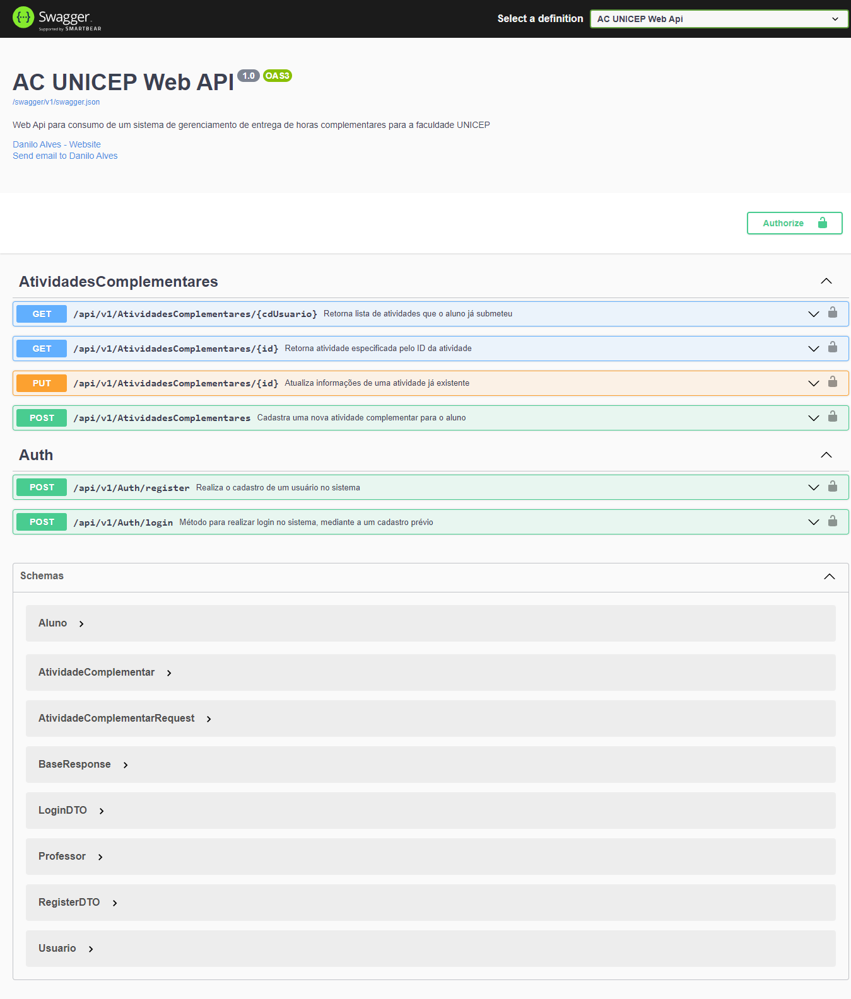
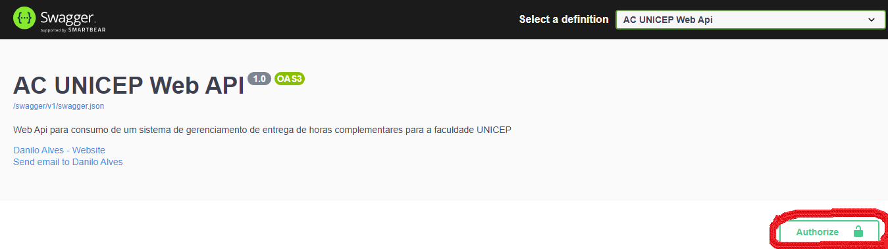
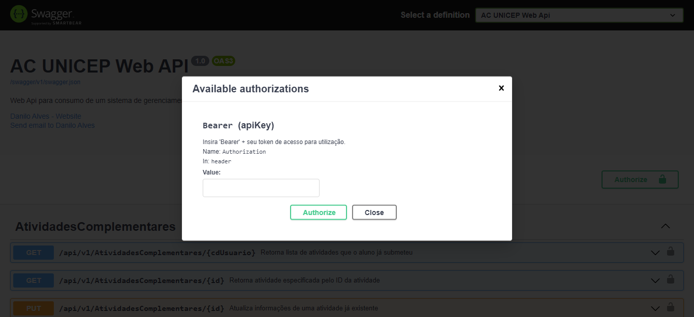
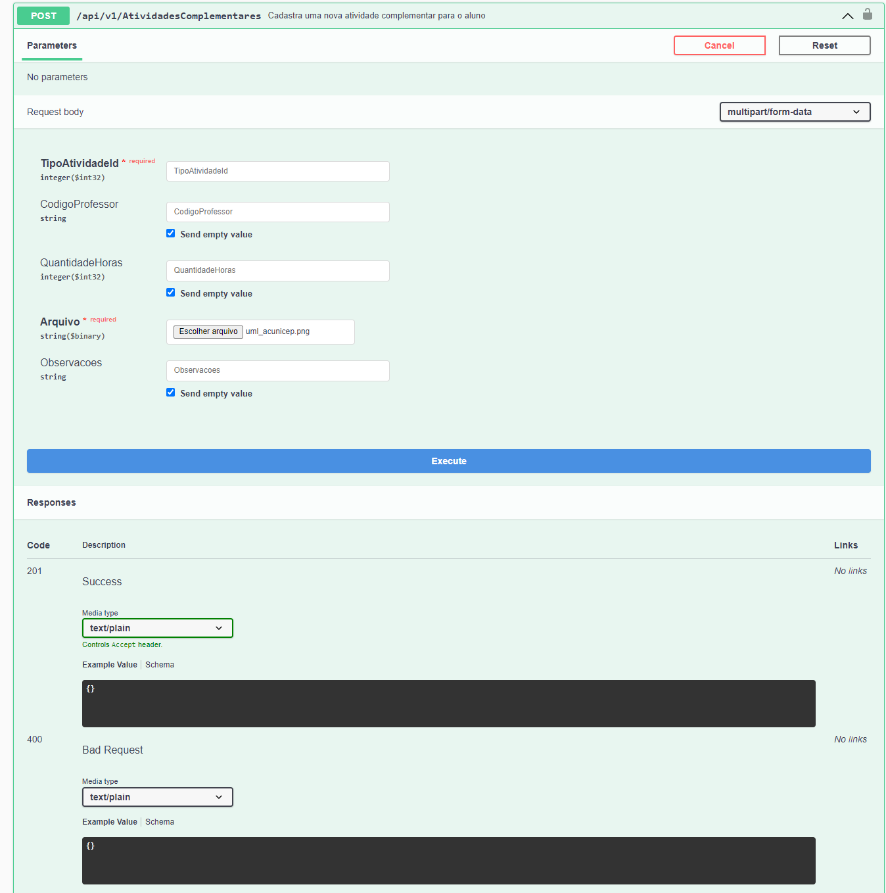

# ACUnicep WebAPI
### Web API para sistema de controle para entrega de horas complementares na UNICEP.

### Em Construção!

## Ao executar a Web API, é aberta esta interface do Swagger com atuais endpoints da aplicação

### Utilizar a rota de login da Controller Auth para criar um usuário e receber um token de acesso como resposta, assim utilzá-lo para acessar as outras rotas.
### Com o token em mãos, é só inseri-lo para se autenticar na Web API.

### Agora pode utilizar as rotas para os testes da API, lembrando que é um primeira versão, ainda será melhorada, tendo algumas falhas.

